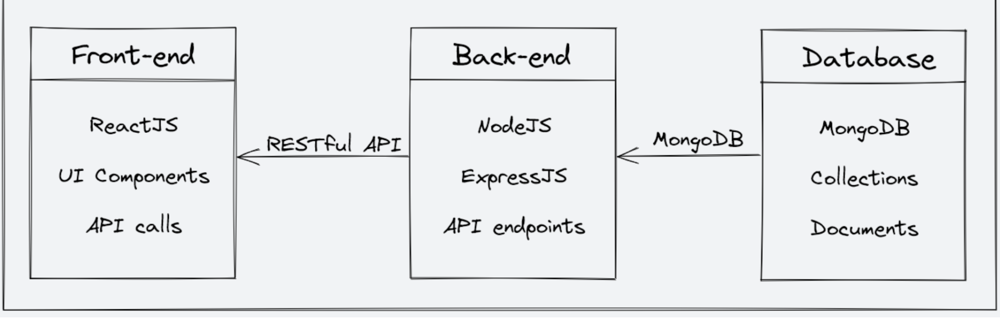
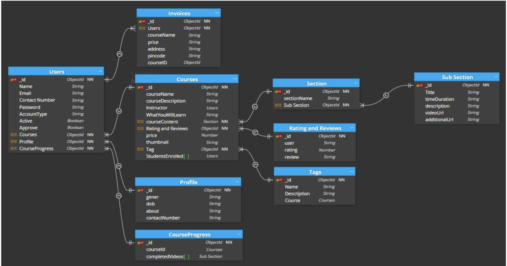

# StudyNotion - An Ed-Tech Platform



A fully functional ed-tech platform that enables users to create, consume, and rate educational content. Built using the MERN stack (MongoDB, Express.js, React.js, Node.js).

## Features

### For Students
- Browse and search courses
- Add courses to wishlist
- Purchase courses with Razorpay integration
- View and rate course content
- Manage user profile

### For Instructors
- Create and manage courses
- Upload course content (videos, documents)
- View course analytics and insights
- Manage instructor profile

### Admin Features (Future Scope)
- Platform analytics dashboard
- User and instructor management
- Content moderation

## Tech Stack

**Frontend:**
- React.js
- Redux (State Management)
- Tailwind CSS
- React Router

**Backend:**
- Node.js
- Express.js
- MongoDB (Database)
- Mongoose (ODM)

- 

**Services:**
- Cloudinary (Media Storage)
- Razorpay (Payment Gateway)
- JWT (Authentication)
- Bcrypt (Password Hashing)

## System Architecture

The platform follows a client-server architecture with three main components:
1. **Frontend**: React.js application
2. **Backend**: Node.js + Express.js server
3. **Database**: MongoDB with Mongoose


Below is the backend design 



## API Design

RESTful API with endpoints for:
- User authentication (JWT)
- Course management
- Payment processing
- Content delivery

Sample endpoints:
```http
/api/auth/signup (POST)
/api/auth/login (POST) – Log in using existing credentials and generate a JWT token.
/api/auth/verify-otp (POST) - Verify the OTP sent to the user's registered email.
/api/auth/forgot-password (POST) - Send an email with a password reset link to the registered email.
/api/courses (GET) - Get a list of all available courses.
/api/courses/:id (GET) - Get details of a specific course by ID.
/api/courses (POST) - Create a new course.
/api/courses/:id (PUT) - Update an existing course by ID.
/api/courses/:id (DELETE) - Delete a course by ID.
/api/courses/:id/rate (POST) - Add a rating (out of 5) to a course.


